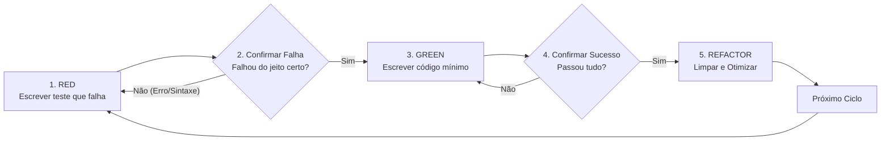

# Desenvolvimento Guiado por Testes (TDD — Test-Driven Development)

## Visão Geral

Escreva o teste primeiro. Veja o teste falhar. Escreva o código mínimo para passar. Refatore.

**Princípio Fundamental:** Se você não viu o teste falhar primeiro, você não sabe se ele está testando a coisa certa.

---

## Quando Usar

**Sempre:**
- Novas funcionalidades e regras de negócio.
- Correção de bugs.
- Refatoração de código existente.
- Alteração de comportamento.

**Exceções (consulte seu parceiro humano):**
- Protótipos descartáveis (Spikes).
- Código gerado automaticamente.
- Arquivos de configuração puramente declarativos.

> [!WARNING]
> Pensando em "pular o TDD só desta vez"? Pare. Isso é racionalização.

---

## A Lei de Ferro do TDD

```
NENHUM CÓDIGO DE PRODUÇÃO SERÁ ESCRITO SEM UM TESTE QUE FALHA PRIMEIRO
```

Escreveu o código antes do teste? **Apague-o.** Comece de novo do zero.

**Sem exceções:**
- Não o guarde como "referência".
- Não o "adapte" enquanto escreve os testes.
- Não olhe para ele.
- Deletar significa deletar de verdade.

---

## O Ciclo Red-Green-Refactor



---

### 1. RED — Escrever o Teste que Falha

Escreva um único teste mínimo demonstrando o comportamento esperado.

#### ❌ Exemplo Ruim (Testando Mocks/Detalhes de Implementação):
```csharp
[Fact]
public async Task TestarRequisicao()
{
    var mock = new Mock<IEntidadeRepository>();
    mock.Setup(x => x.GetByIdAsync(1, CancellationToken.None)).ReturnsAsync(new Entidade());
    var service = new EntidadeService(mock.Object, ...);
    await service.ObterPorIdAsync(1);
    mock.Verify(x => x.GetByIdAsync(1, CancellationToken.None), Times.Once);
}
```

#### ✅ Exemplo Bom (Comportamento de Negócio Claro):
```csharp
[Fact]
public async Task ObterPorIdAsync_QuandoEntidadeExiste_DeveRetornarEntidadeComRelacionamentos()
{
    // Arrange
    var idEsperado = 1;

    // Act
    var resultado = await _service.ObterPorIdAsync(idEsperado);

    // Assert
    Assert.NotNull(resultado);
    Assert.Equal(idEsperado, resultado.IdEntidade);
}
```

---

### 2. Verificar o RED — Ver a Falha

**OBRIGATÓRIO. Nunca pule esta etapa.**

Execute o teste via terminal:
```bash
dotnet test --filter "FullyQualifiedName~ObterPorIdAsync"
```

Confirme:
1. O teste **falha** (não erro de sintaxe/compilação).
2. A mensagem de erro é a esperada (ex: `Assert.NotNull() Failure`).
3. O teste falha porque a funcionalidade ainda não existe, não por erro no script.

---

### 3. GREEN — Código Mínimo para Passar

Escreva o código mais simples possível para fazer o teste passar.

```csharp
public async Task<Entidade?> ObterPorIdAsync(int id, CancellationToken cancellationToken = default)
{
    return await _repository.GetByIdAsync(id, cancellationToken);
}
```

> [!IMPORTANT]
> Não adicione funcionalidades extras, não refatore outros arquivos, não tente "adivinhar o futuro" (YAGNI — You Aren't Gonna Need It).

---

### 4. Verificar o GREEN — Confirmar Sucesso

**OBRIGATÓRIO.**

Execute novamente a suíte de testes:
```bash
dotnet test
```

Confirme:
- O novo teste passa (`Pass: 1`).
- Todos os testes anteriores continuam passando sem regressão.

---

### 5. REFACTOR — Limpar e Otimizar

Com a segurança dos testes passando:
- Remova código duplicado.
- Melhore os nomes de variáveis e métodos.
- Garanta que a arquitetura respeita os princípios SOLID, Clean Code e as 12 leis do `AGENTS.md`.
- Execute `dotnet test` novamente ao final para garantir que continua tudo verde (`GREEN`).
