# Análise Técnica: Integração de Enumerados e Parametrização (Legado -> .NET 10 + React)

> **Tipo:** Proposta de Arquitetura e Integração  
> **Status:** Aguardando Aprovação  
> **Objetivo:** Definir a estratégia padrão para unificar e sincronizar enums (tabela `GloTipoEnumerado`) e parâmetros do sistema (tabela `GloParametro`) entre o backend C# e o frontend React, de forma dinâmica e escalável para todo o ERP.

---

## 1. O Cenário Legado

### A. Parâmetros (`GloParametro`)
- Armazena configurações gerais (ex.: `AceitaCnpjCpfInvalido`, `CPFCNPJOBRIGATORIO`).
- Já está mapeado no novo backend através de `IParametroRepository` e da entidade `Parametro` (que aponta para a tabela `GloParametro`).

### B. Enumerados (`GloTipoEnumerado`)
No ERP legado, os enums C# não têm seus textos (labels) fixados no código. Em vez disso, eles são decorados com um atributo:

```csharp
[TipoEnumerado(1)] // 1 é o IdPai da lista no banco
public enum EntidadeFisicaJuridica
{
    Fisica = 2,
    Juridica = 3
}
```

No banco de dados (`GloTipoEnumerado`), existem os seguintes registros:

| IdGloTipoEnumerado | IdGloTipoEnumeradoPai | Descricao | Ordem |
|---|---|---|---|
| **1** | *NULL* | *Grupo de Tipo Pessoa* | 0 |
| **2** | **1** | Pessoa Física | 1 |
| **3** | **1** | Pessoa Jurídica | 2 |
| **4** | *NULL* | *Grupo de Tipos de Entidade* | 0 |
| **5** | **4** | Fornecedor | 1 |
| **6** | **4** | Cliente | 2 |

O ERP desktop lia o atributo `[TipoEnumerado(idPai)]` via reflexão e buscava as descrições no banco de dados em tempo de execução para preencher os ComboBoxes da interface gráfica.

---

## 2. A Solução Proposta para .NET 10 + React

Para evitar duplicar esses enums no React de forma "hardcoded" (o que exigiria manutenção manual e geraria inconsistências), propomos uma **integração dinâmica de ponta a ponta**.

```mermaid
sequenceDiagram
    participant React as Frontend (React Component)
    participant Context as EnumContext/Hook
    participant API as Backend Controller (.NET 10)
    participant DB as Banco de Dados (GloTipoEnumerado)

    React->>Context: useEnum(idPai)
    alt Não está em cache
        Context->>API: GET /api/enumerado/{idPai}
        API->>DB: Query por IdGloTipoEnumeradoPai == idPai
        DB-->>API: Lista de itens (Id, Descricao, Ordem)
        API-->>Context: JSON [ { id, label } ]
    end
    Context-->>React: Opções do Dropdown (Física, Jurídica, etc.)
    React->>React: Renderiza <Select> com opções reais do banco
```



---

## 3. Implementação Técnica

### Passo 1 — Mapeamento do Domínio no C# (Backend)

Criar a entidade `TipoEnumerado` na camada de Domínio como uma POCO pura, sem Data Annotations (respeitando a Lei nº 1 de Pureza de Domínio):

```csharp
// Path: src/Versatus.AcessoGlobal/Domain/Entities/TipoEnumerado.cs
namespace Versatus.AcessoGlobal.Domain.Entities;

public class TipoEnumerado
{
    public int IdTipoEnumerado { get; set; } // IdGloTipoEnumerado no banco
    public int? IdTipoEnumeradoPai { get; set; } // IdGloTipoEnumeradoPai no banco
    public string Descricao { get; set; } = string.Empty;
    public int Ordem { get; set; }
}
```

E no `AcessoGlobalDbContext.cs`, mapear via Fluent API:

```csharp
// Dentro do mapeamento da infraestrutura:
modelBuilder.Entity<TipoEnumerado>(entity =>
{
    entity.ToTable("GloTipoEnumerado");
    entity.HasKey(e => e.IdTipoEnumerado);
    entity.Property(e => e.IdTipoEnumerado).HasColumnName("IdGloTipoEnumerado");
    entity.Property(e => e.IdTipoEnumeradoPai).HasColumnName("IdGloTipoEnumeradoPai");
    entity.Property(e => e.Descricao).HasColumnName("Descricao").HasMaxLength(250);
    entity.Property(e => e.Ordem).HasColumnName("Ordem");
});
```

---

### Passo 2 — Criação do Endpoint da API (Backend)

Criar um controller genérico para ler os enumerados do banco:

```csharp
// Path: src/Versatus.AcessoGlobal/Api/Controllers/TipoEnumeradoController.cs
[ApiController]
[Route("api/[controller]")]
public class TipoEnumeradoController : ControllerBase
{
    private readonly AcessoGlobalDbContext _context;

    public TipoEnumeradoController(AcessoGlobalDbContext context)
    {
        _context = context;
    }

    [HttpGet("{idPai}")]
    public async Task<IActionResult> GetByPai(int idPai)
    {
        var itens = await _context.Set<TipoEnumerado>()
            .Where(x => x.IdTipoEnumeradoPai == idPai)
            .OrderBy(x => x.Ordem)
            .Select(x => new { value = x.IdTipoEnumerado, label = x.Descricao })
            .ToListAsync();

        return Ok(itens);
    }
}
```

---

### Passo 3 — O Hook do React (Frontend)

Criar um Contexto e um Hook global no React para gerenciar e cachear as consultas de enumerados para evitar chamadas de API repetidas para a mesma informação:

```typescript
// Path: src/Versatus.Frontend/src/hooks/useEnums.ts
import { useState, useEffect } from 'react';
import axios from 'axios';

interface EnumOption {
  value: number;
  label: string;
}

const enumCache: Record<number, EnumOption[]> = {};

export function useEnumOptions(idPai: number) {
  const [options, setOptions] = useState<EnumOption[]>(enumCache[idPai] || []);
  const [loading, setLoading] = useState(!enumCache[idPai]);

  useEffect(() => {
    if (enumCache[idPai]) {
      setOptions(enumCache[idPai]);
      setLoading(false);
      return;
    }

    axios.get(`/api/tipoenumerado/${idPai}`)
      .then(res => {
        enumCache[idPai] = res.data;
        setOptions(res.data);
      })
      .catch(err => console.error("Erro ao carregar enum", err))
      .finally(() => setLoading(false));
  }, [idPai]);

  return { options, loading };
}
```

---

### Passo 4 — Consumo no Componente React

Na View do formulário (`index.tsx`), em vez de hardcodear opções, chamamos o hook:

```tsx
// Exemplo de uso na FEntidade/index.tsx
import { useEnumOptions } from '../../hooks/useEnums';

export function EntidadeFormView() {
  const { options: tipoPessoaOptions } = useEnumOptions(1); // idPai = 1
  const { options: tipoEntidadeOptions } = useEnumOptions(4); // idPai = 4

  return (
    <Select 
      name="tipoPessoa" 
      options={tipoPessoaOptions} // "Física" (2) e "Jurídica" (3) vêm direto do banco!
    />
  );
}
```

---

## 4. Integração com Parametrização (`GloParametro`)

Da mesma forma, as parametrizações podem ser expostas e consumidas de forma simples.

### Exemplo: Verificar se CPF/CNPJ é obrigatório
O backend expõe o endpoint `GET /api/parametro/valor/CPFCNPJOBRIGATORIO`.
No frontend, criamos um hook semelhante para ler e cachear parâmetros importantes de interface:

```typescript
// Path: src/Versatus.Frontend/src/hooks/useParametros.ts
export function useParametro(chave: string) {
  const [valor, setValor] = useState<string | null>(null);

  useEffect(() => {
    axios.get(`/api/parametro/valor/${chave}`)
      .then(res => setValor(res.data))
      .catch(err => console.error(err));
  }, [chave]);

  return valor;
}
```

No formulário do React:
```tsx
const cpfCnpjObrigatorio = useParametro("CPFCNPJOBRIGATORIO");
// cpfCnpjObrigatorio conterá "BloquearSalvar", "Avisar" ou null
```

---

## 5. Como os Agentes farão essa conversão automaticamente?

Adicionando essa arquitetura de Enums Dinâmicos no repositório, o **Agente 1** (Analista) e o **Agente 3** (Frontend) lerão as regras do arquivo `enum_mapping_guide.md` e do `SKILL.md` atualizados.

Quando eles encontrarem um Enum legado no código `.cs` decorado com `[TipoEnumerado(X)]`:
1. **No backend:** O agente não criará arrays ou enums hardcoded na API — apenas usará a tabela no banco.
2. **No frontend:** O agente gerará automaticamente o consumo no formulário React chamando `useEnumOptions(X)`.
3. Isso garante que **100% dos dropdowns e inputs de enums do sistema** sigam o mesmo padrão dinâmico sem você precisar configurar nada manualmente por tela!

---

## 💡 Próximo Passo e Decisão

Para que essa solução funcione perfeitamente em todo o ERP, precisamos:
1. Criar a entidade e mapeamento de `TipoEnumerado` no backend.
2. Criar a API `/api/tipoenumerado/{idPai}`.
3. Criar o hook `useEnumOptions` no frontend.

Deseja que incluamos essa **Fase de Fundação de Enums Dinâmicos** como o primeiro passo no nosso Plano de Implementação para executarmos agora?
