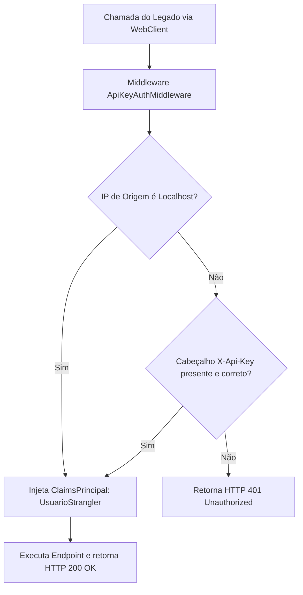

# DEC-006 — Arquitetura de Integração Segura e Estrangulamento (Legado ↔ .NET 8 API)

## Contexto e Desafio

Na migração progressiva do ERP legado Versatus utilizando o **Padrão de Estrangulamento (Strangler Fig Pattern)**, partes do legado começam a delegar sua lógica e consultas para a nova Web API em .NET 8. Essa comunicação ocorre de servidor para servidor (Service-to-Service).

A nova Web API .NET 8 utiliza autenticação baseada em tokens JWT (`JwtBearer`) para as conexões de clientes e interfaces de usuário. Contudo, implementar o fluxo completo de tokens JWT no legado (.NET Framework 4.7) introduz complexidades severas:
* Necessidade de gerenciar credenciais dinâmicas no legado.
* Tratamento de expiração de tokens e lógica de renovação (refresh token).
* Aumento desnecessário do código do legado (que deve ser modificado o mínimo possível).

Precisamos de um mecanismo que garanta que:
1. A API principal do .NET 8 recuse chamadas externas não autorizadas.
2. O legado consiga autenticar suas chamadas HTTP internas de forma extremamente simples e leve.
3. Desenvolvedores consigam debugar localmente sem a necessidade de gerenciar chaves complexas.

---

## Decisão

Adotamos uma abordagem híbrida de segurança para a comunicação de estrangulamento baseada em **API Key Compartilhada** e **Bypass de Loopback Local**.

O fluxo de autenticação seguirá as seguintes regras:
1. **Ambiente de Desenvolvimento (Localhost):** Toda requisição cujo IP de origem seja o próprio loopback local (`127.0.0.1` ou `::1`) é considerada confiável e autorizada automaticamente (Bypass).
2. **Ambientes Distribuídos (Staging/Produção):** A requisição é autorizada apenas se contiver no cabeçalho HTTP a chave `"X-Api-Key"` contendo o token secreto de integração correspondente ao configurado no servidor.

---

## Funcionamento Detalhado

### Fluxo de Comunicação
O diagrama abaixo demonstra o fluxo de decisão de segurança que ocorre a cada chamada HTTP feita pelo legado:



### 1. No Legado (Remetente)
O utilitário [FinancialStranglerHelper.cs](file:///c:/Pasta%20de%20Trabalho/Projetos/Analises/Versatus/Versatus.Net8/projeto_tag_1906/servidor/framework/Servidor.Strangler/Common/FinancialStranglerHelper.cs) busca no `App.config` / `Web.config` a chave:
```xml
<add key="Net8StranglerApiKey" value="SUA_CHAVE_SUPER_SECRETA" />
```
Caso exista, ele a insere no cabeçalho HTTP:
```csharp
client.Headers["X-Api-Key"] = _stranglerApiKey;
```

### 2. Na API .NET 8 (Destinatário)
Um middleware customizado (`ApiKeyAuthMiddleware`) intercepta todas as requisições HTTP e valida as credenciais:
* **Obtenção do IP:** Inspeciona `context.Connection.RemoteIpAddress`.
* **Validação da Chave:** Compara o valor obtido em `X-Api-Key` com a propriedade `Security:StranglerApiKey` definida no `appsettings.json`.
* **Estabelecimento do Contexto (Claims):** Em caso de sucesso (por chave válida ou IP local), o middleware gera um `ClaimsPrincipal` contendo uma identidade administrativa interna (ex: `Name = "UsuarioStrangler"`). Isso garante que filtros de autorização subsequentes (`[Authorize]`) e tabelas de log de auditoria no banco de dados reconheçam quem disparou a operação.

---

## Rationale (Por que esta abordagem?)

1. **Simplicidade do Legado:** O legado apenas anexa um cabeçalho fixo lido do arquivo de configuração. Não há controle de estado de autenticação ou expiração.
2. **Segurança Desacoplada:** A chave secreta pode ser alterada nas configurações dos servidores de aplicação sem a necessidade de recompilar nenhum dos sistemas.
3. **Auditoria Clara:** Como o middleware injeta um `ClaimsPrincipal` específico para o strangler, todo log ou registro do EF Core saberá que a alteração foi originada pela transição do legado, facilitando auditoria e debug.
4. **Segurança em Ambientes Híbridos:** Funciona perfeitamente caso a API nova seja migrada para a nuvem ou servidores apartados do legado, exigindo apenas o tráfego sob canal criptografado (HTTPS).
